# SafeOn React PWA 인턴 프로젝트

React 기반으로 개발한 안전 관리 서비스의 일부 화면을 PWA + Capacitor 구조로 구현하고, 기존 기능을 추가·개선한 인턴십 프로젝트입니다.

> 서비스 테스트와 검수대장을 기반으로 화면을 설계 및 구현했습니다.
또한 PWA 및 네이티브 빌드까지 직접 수행하며 배포 과정을 경험했습니다.

---

## 개선 배경

개선해야할 부분은 2가지, 추가 개발하야할 것은 1가지 총 3가지 였습니다. 

세 가지는 다음과 같습니다.
- 관리자 서비스에서 MUI로 만들어진 테이블에서 데이터를 조회할 때 필터 기능을 어떻게 쓰는지 잘 모르겠다는 고령층 사용자의 답변으로 개선 필요
  

  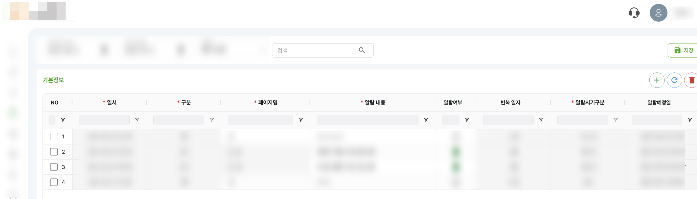 
  그림 1. 기존 데이터 필터 기능 화면

- 공지사항의 입력폼 UI 개선

  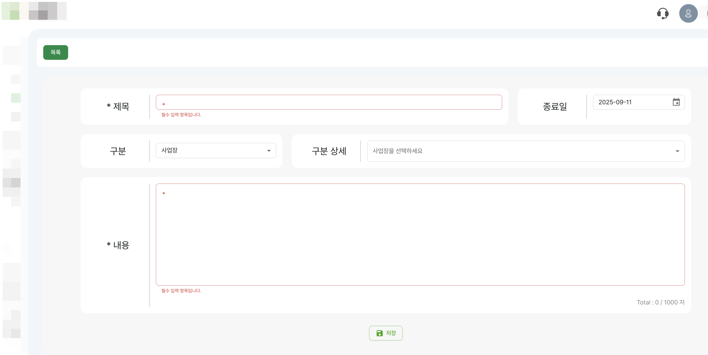 
  그림 2. 기존 공지사항 입력 폼 화면

- 마이페이지에서 사용자의 자신의 정보와 싸인을 남겨놓을 수 있도록 페이지 구현

  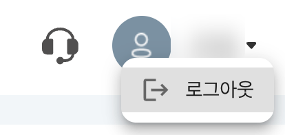 
  그림 3. 기존 프로필 화면

## 개선 방향 디자인 및 추가 기능 디자인
### 필터 부분 개선 디자인
1. 첫 번째 디자인

  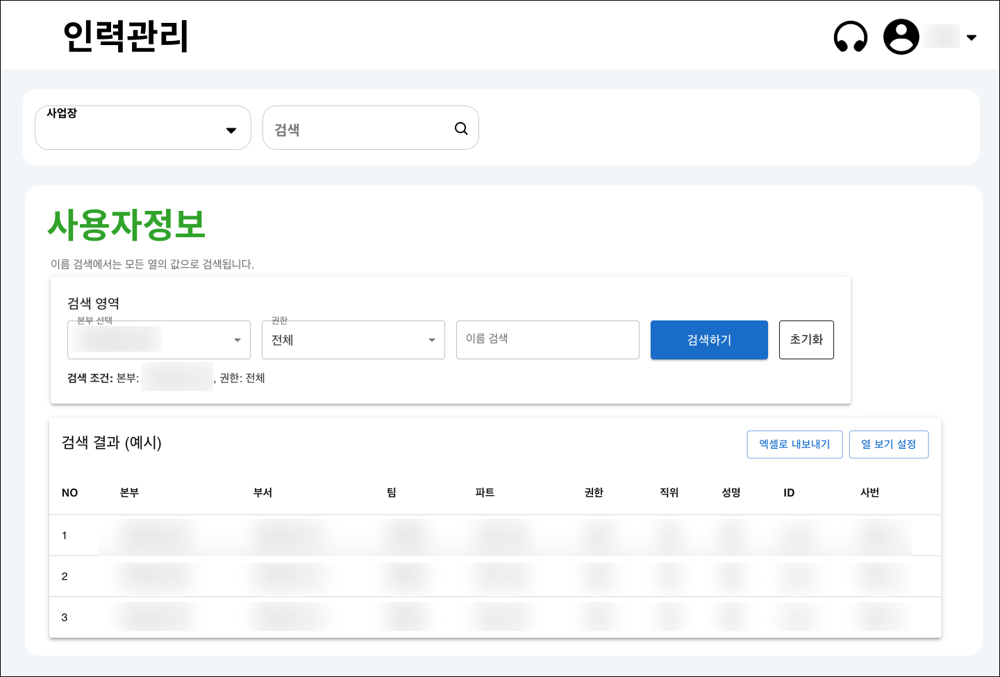 
  그림 4. 데이터 필터 화면 디자인

다음과 같은 피드백을 받게 되었습니다.
- 이 안전 관리 서비스는 고령층 사용자가 많기 때문에 화면에 너무 많이 차지하기 되면 문제이다. 고령층 사용자들은 화면을 확대해서 보기 때문에 UX를 좀 더 생각해봐야할 것 같다.
  

2. 피드백 후 디자인

  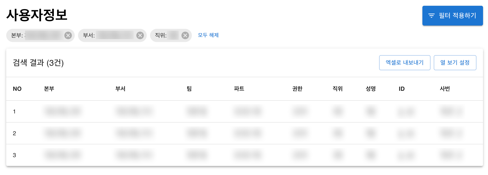 
  그림 5. 피드백 후 디자인

### 공지사항 입력폼 개선 디자인
(데이터는 예시로 한 것이라 모자이크 처리는 하지 않았습니다.)

  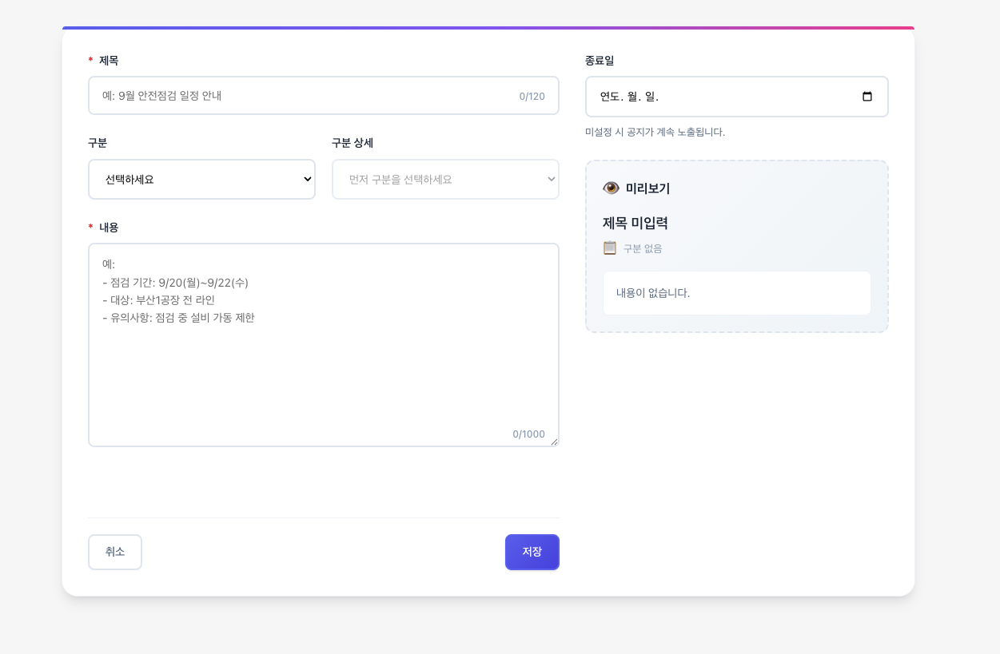 
  그림 6. 공지사항 입력 폼 디자인

### 마이페이지의 자신의 정보와 싸인 개발 디자인
  

  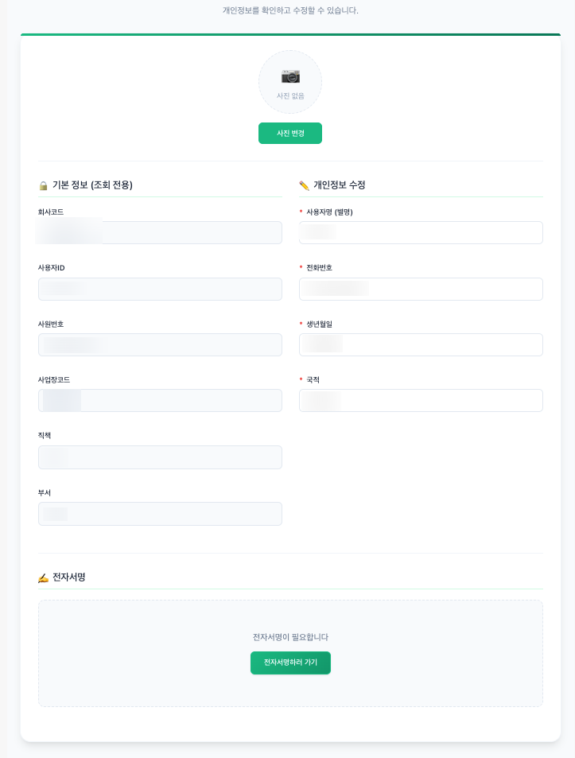 
  그림 6. 마이페이지 화면 디자인

---

## 사용 기술 및 구현 방식 요약
### 기존 데이터 필터 기능 화면
[FilterPage.js](./src/pages/filter/FilterPage.js)
[FilterPage.css](./src/pages/filter/FilterPage.css)

- Material UI(MUI)를 사용하여 Table, Dialog, Select, Chip, Stack 등 컴포넌트 UI 구성했습니다.
- 별도 CSS 파일을 만들어 MUL 기본 스타일 위에 필요한 부분만 커스텀했습니다.

### 공지사항 입력 폼 화면 
[NoticePage.js](./src/pages/notice/NoticePage.js)
[NoticePage.css](./src/pages/notice/NoticePage.css)
- framer-motion을 사용해 작성 진행률을 보여주는 progress Bar 애니메이션을 구현했습니다.
- lucide-react 아이콘(Eye)으로 미리보기 영역을 표현했습니다.

### 마이페이지 화면
[MyPage.js](./src/pages/mypage/MyPage.js)
[MyPage.css](./src/pages/mypage/MyPage.css)
- react-signature-canvas를 사용해 팝업 모달에서 전자서명 패드를 제공하고, 서명을 이미지 데이터(URL)로 저장 및 미리보기 할 수 있도록 구현했습니다.
- 프로필 사진 업로드는 FileReader + Data URL 방식으로 처리하여 사용자가 선택한 이미지를 프로필 영역에 반영하도록 했습니다.

--- 

## 결과 화면
(결과 화면은 사진으로 대체하겠습니다. - 노출되면 안 되는 데이터를 모자이크 처리하기 위함입니다.)

### 필터 부분 개선 결과 
  

   
  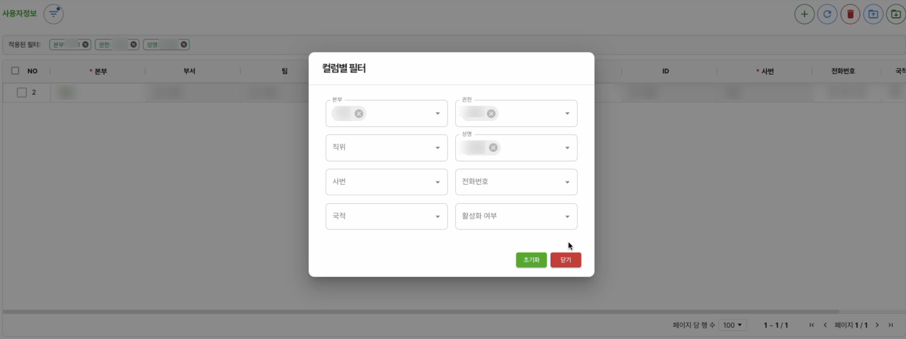 
  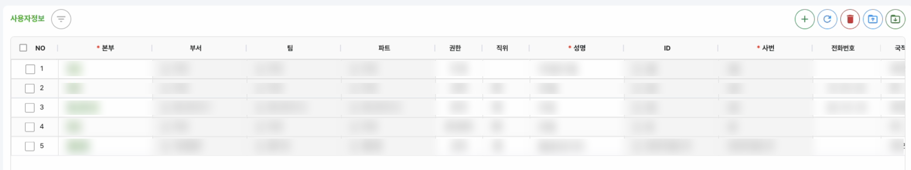 

### 공지사항 입력폼 개선 결과
  

  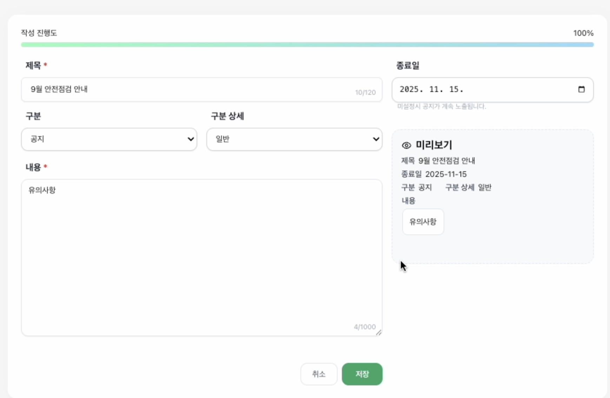 

### 마이페이지 개발 결과
  

  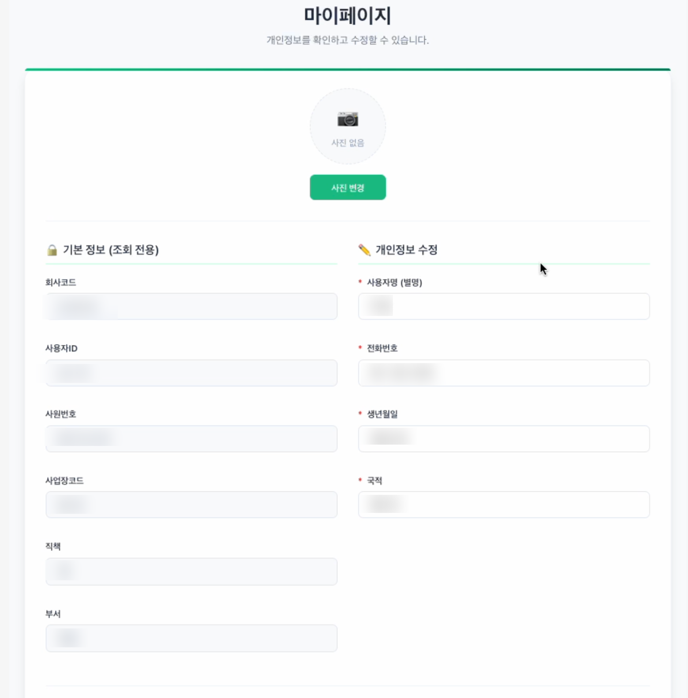 
  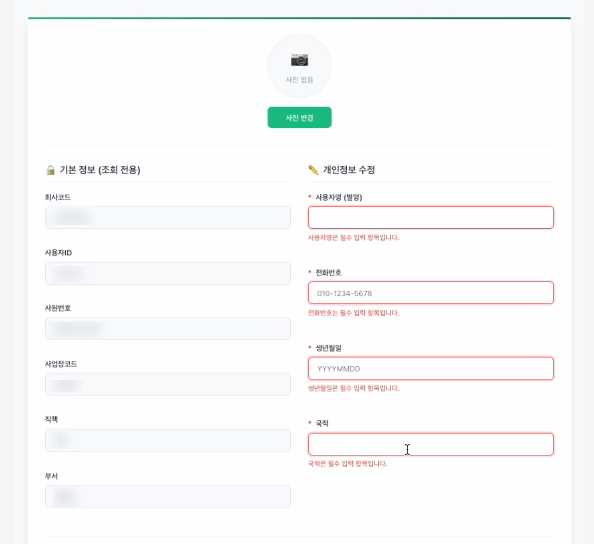 
  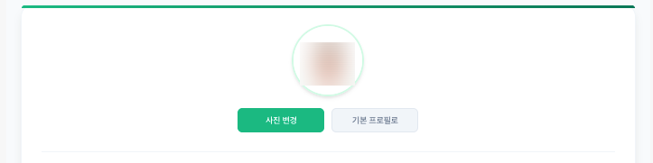 
    그림 7. 프로필 사진 기능
  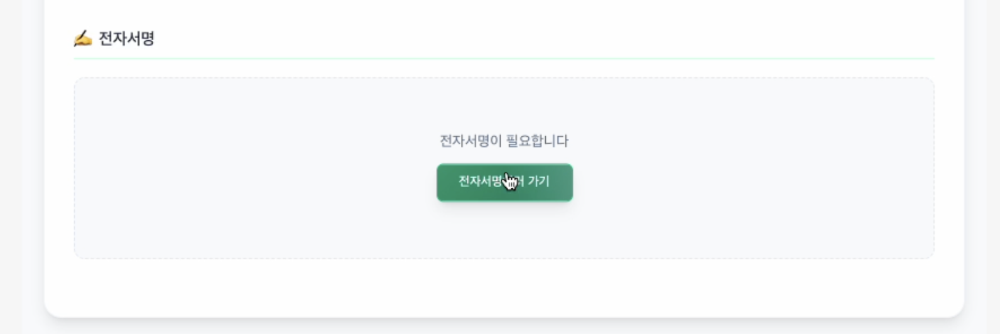 
   그림 8. 싸인 기능
  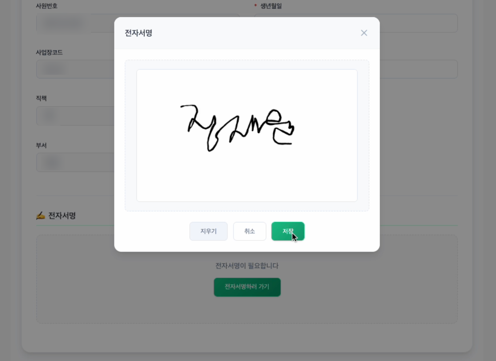 
  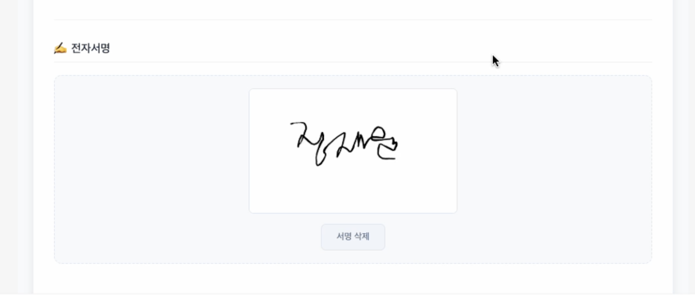 

